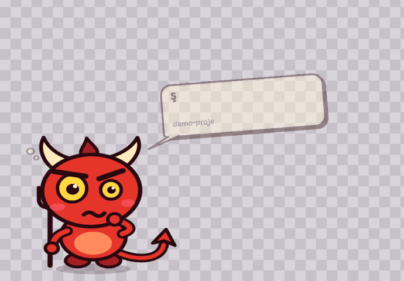
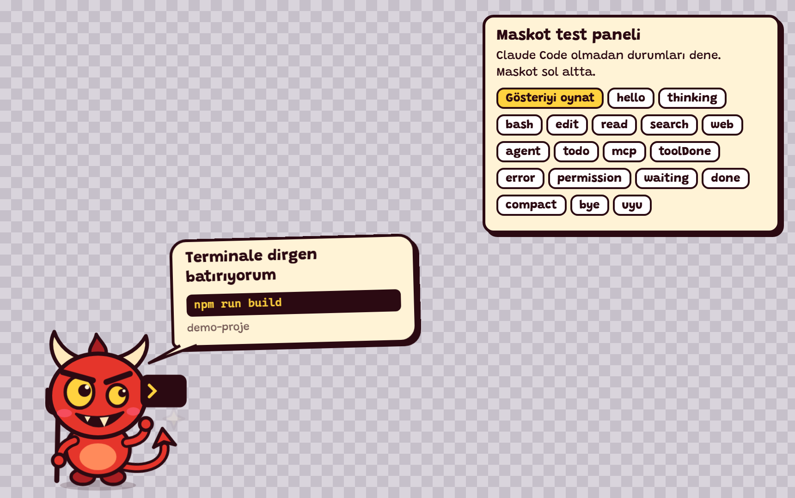
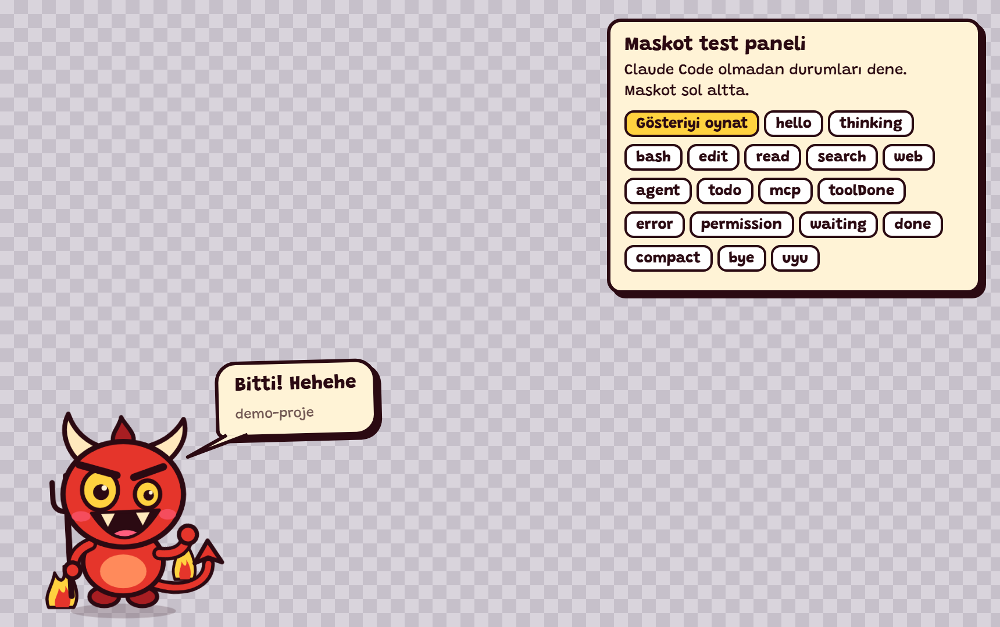

# Şeytan Maskot

Claude Code çalışırken ekranının köşesinde sana eşlik eden, Türkçe konuşan küçük bir şeytan. Düşünürken çenesini kaşır, terminalde çalışırken dirgenini sallar, izin beklerken ayağını vurur. İş bitince kutlar.

**Proje: [torunum](https://github.com/torunum)** · [GitHub deposu](https://github.com/torunum/seytan-maskot)



*Gerçek tarayıcı demosundan 10 saniyelik kayıt. Durumlar demo paneline tıklanarak gösterilmiştir; canlı bir Claude Code oturumu kaydı değildir.*

## Neler Yapar?

- Claude Code'un düşünme, dosya okuma ve düzenleme, arama, terminal, web ve araç durumlarına farklı pozlarla tepki verir.
- İzin beklediğinde, hata olduğunda ve iş tamamlandığında haber verir.
- Masaüstünde şeffaf, çerçevesiz bir Electron penceresinde görünür.
- Tıklanınca tepki verir; art arda dürtülünce sinirlenir. Boşta kalınca uyur.
- Sürüklenebilir ve masaüstündeki konumunu hatırlar.

## Hızlı Deneme

İndirdiğin veya klonladığın proje klasöründe:

```bash
node server.js
```

Tarayıcıda [demo panelini aç](http://127.0.0.1:47620/?demo). Bu deneme için Electron kurulumu veya Claude Code bağlantısı gerekmez. Paneldeki düğmelerle durumları deneyebilirsin.

Tarayıcı sürümü sayfanın içinde çalışır. Diğer uygulamaların üzerinde duran masaüstü maskotu için aşağıdaki kurulumu kullan.

## Masaüstü Kurulumu

**Gereksinimler:** Node.js **22.12 veya üzeri**, npm ve Claude Code. Depodaki Electron sürümü Node.js 22.12+ gerektirir.

Proje klasöründe:

```bash
npm install
npm run kur
npm start
```

`npm run kur`, maskot hook'larını Claude Code kullanıcı ayarlarına ekler. Mevcut ayar dosyası varsa önce yedek alır. Bu bağlantı kullanıcı düzeyinde kurulur ve farklı projelerdeki Claude Code oturumları için de geçerlidir. Ayar klasörü varsayılan olarak `~/.claude` yoludur; `CLAUDE_CONFIG_DIR` tanımlıysa o klasör kullanılır.

Claude Code içinde `/hooks` ile kayıtları kontrol edebilirsin. Ardından herhangi bir projede çalışmaya başladığında maskot olaylara tepki verir.

## Kullanım

| Etkileşim | Sonuç |
| --- | --- |
| Maskota tıkla | Dürt ve tepkisini gör. |
| Sürükle | Masaüstündeki yerini değiştir. |
| Sağ tıkla | Test gösterisini oynat, sol alt köşeye geri koy veya kapat. |
| Bir süre boş bırak | Uykuya dalmasını izle; tıklayarak uyandır. |

### Terminalde Çalışırken



### İş Tamamlandığında



## Nasıl Çalışır?

```text
Claude Code -> hook.js -> yerel HTTP sunucusu -> SSE -> mascot.html
```

`hook.js`, Claude Code olaylarından gerekli alanları seçip yerel sunucuya gönderir. `server.js` bunları maskot durumlarına çevirir; `mascot.html` pozları, animasyonları ve konuşma balonlarını gösterir. Masaüstü penceresini Electron açar.

Sunucu yalnızca `127.0.0.1` üzerinde dinler. Prompt metni, konuşma dökümünün yolu ve araç çıktıları aktarılmaz. Bununla birlikte komut metinleri, dosya yolları, arama sorguları ve bazı bildirim alanları yerel köprüden geçebilir; komut veya dosya adları konuşma balonunda görünebilir. Ekran paylaşırken buna dikkat et.

Hook'lar asenkron çalışır. Maskot açık değilse köprü bağlantı hatası göstermeden çıkar.

## Kaldırma

```bash
npm run kaldir
```

Bu komut maskota ait hook kayıtlarını kaldırır ve diğer hook kayıtlarını korur. Açık maskot penceresini sağ tık menüsünden kapatabilirsin.

## Özelleştirme

`mascot.html` içindeki `LINES` konuşma satırlarını, `POSES` ise durumlara ait poz ve aksesuarları içerir. Yerel sunucunun varsayılan portu `47620`'dir. Değiştirmek için hem maskotu hem Claude Code'u aynı `MASKOT_PORT` değeriyle başlat.

Node.js kurulum yolunu değiştirirsen `npm run kur` komutunu yeniden çalıştır. Claude Code ve maskotu WSL/Windows sınırının aynı tarafında çalıştırmak bağlantıyı kolaylaştırır. Linux'ta pencerenin boş alanlarından alttaki uygulamaya tıklama aktarımı desteklenmez.

## Katkı Ve Lisans Notu

Proje: **[torunum](https://github.com/torunum)**.

Yazı tipi: **Grandstander**, **SIL Open Font License 1.1**. [Telif ve lisans bildirimi](fonts/OFL.txt) dağıtımla birlikte korunur. [Resmi kaynak](https://github.com/google/fonts/tree/main/ofl/grandstander).
